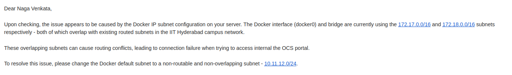

# Understanding Docker Networking - A Deep Dive

**Prerequisites:** Very basic knowledge of Linux and networking (though I'll try to explain everything from scratch)

**Note:** Whenever I say "container," think of it as a mini computer (as explained in my previous blog)

## Quick Recap

In my previous blog, we saw that a Docker container is just like a mini computer that's isolated from the host machine.

Now think about this analogy:
- Your laptop is also isolated from the external world
- If we think of the external world as the host, then your laptop becomes like a small container - a mini computer

So we can easily understand networks inside a container if we first understand how networks work on your laptop.

## How Does Networking Work on Your Laptop?

*[Note: This is not about how the internet works - that's for another blog]*

Let's break it down:

- **Data travels in packets** - All data on the internet travels in small chunks called packets (if you didn't know this, congrats! You just learned a new concept)

- **Packets need a medium** - There should be a medium for these packets to travel. They can't just magically move around in your laptop. In networking terms, we call this medium an **interface**.

- **Interfaces are everywhere** - So packets in your laptop (and actually on any machine on this planet) travel through these interfaces.

- **IP Addresses** – Every device on a network needs a unique address to send and receive packets. This address, called an IP address, works just like a home address — it ensures data reaches the right destination.

- **The network stack** - These network interfaces, IP addresses, and some other stuff combined together make what we call a **network stack** in your laptop (literally a stack of things).

And this network stack + some other components = **network namespace**

## Connecting This to Docker

If you understood this concept, you've basically understood container networking! Since a container is also a mini computer just like your laptop.

And exactly as you guessed, there will be a **separate network stack for each container**.

## The Ultimate Question

**How the hell are these containers connected to the outside world, and how are they connected to each other?**

Here comes the logic:

When you install Docker, a **default bridge** is created with an IP address `172.17.0.1` on most computers (more about this in just a few minutes).

### What Happens When You Create a Container?

**Step 1:** A separate network interface is created for the container, which contains a network interface called `eth0`.

**Step 2:** A separate network interface is created called `vethABC` (some random veth name) on the host machine (your laptop).

Okay, so now network interfaces are created, so packets should be able to travel between them, right? But wait - there's no connection here!

This is exactly where the **bridge** comes in (notice how the name is similar - "bridge" means connecting something).

Now `docker0` will connect `veth` and `eth0`, and there you go! Now your packets can travel between containers.

## The Default Network

This is the default network that you get when you run basic containers, and you'll most probably work on this unless you're a pro like me.

Here's a basic visualization:

```
Container 1 (eth0) ←→ veth1 ←→ docker0 bridge ←→ veth2 ←→ Container 2 (eth0)
                                    ↓
                                  (NAT)
                                    ↓
                              External Network
```

*(More on NAT in another blog)*

See how you're using only one bridge for all containers? That implies traffic must be able to communicate with each other.

**⟹ It is possible for Docker containers to talk with each other on the default network**

## Let's Get Practical!

**If you're completely new to Linux and don't even know what that is:** Skip this section and move to the next one. You've already got a very strong foundation after reading the networking explanation above.

### For Linux Users - Let's Verify

Do this in your Linux system:

```bash
ifconfig
```

You should see the `docker0` bridge with IP `172.17.0.1`.

### Let's Try Communication Between Docker Containers

Let's create 2 Ubuntu containers and try to ping one container from another.

*(Hope Docker is installed on your machine)*

In my last blog, I missed one useful command that comes in handy when you're debugging. We only saw the `run` command, but here we'll see an extension of that.

#### Creating the Containers

```bash
docker run --name ubuntu-container-1 -itd ubuntu:latest
```

- `-it` means run the container in interactive mode
- `-d` means detached (we saw this in the last blog)
- Interactive means you can literally go into that container and interact with it (remember how I said a container is a mini computer? Now we'll go inside it and interact with it!)

#### Entering the Container

```bash
docker exec -it ubuntu-container-1 /bin/bash
```

And there you go! You're inside `ubuntu-container-1`.

Similarly, create `ubuntu-container-2`.

### Let's Make Them Talk

In order to talk, we need an address - in this case, an IP address.

Do this inside both containers:

```bash
apt-get update
apt-get install net-tools
```

Now type `ifconfig` and you'll see the IP address of the container.

Someone needs to initiate the conversation! Go to one of the containers and ping the other container:

```bash
ping <ip-address-of-other-container>
```

*(If ping is not available, download it: `apt install iputils-ping`)*

**Damn! There you go - your packets are being transferred!**

Now take a deep breath, visualize the concepts taught till now, and go drink some water. 

## Practical Application (Real World Usage)

The whole theory you studied above is the underlying concept of how networking works.

But to work in daily life, you don't need all of this complexity. You just need to know:

1. **Port forwarding** - Which exposes your app to the public
2. **How to create and interact with your networks**

### Port Forwarding Example

When you want to expose a container's port to the outside world:

```bash
docker run -p 8080:80 nginx
```

This maps port 8080 on your host to port 80 inside the container. Now you can access the container's service at `localhost:8080`.

### Creating Custom Networks

You can create your own bridge network:

```bash
docker network create my-custom-network
```

Run containers on this network:

```bash
docker run --name container-1 --network my-custom-network -d ubuntu
docker run --name container-2 --network my-custom-network -d ubuntu
```

Now these two containers can talk to each other using their container names!

### When Do You Need the Deep Knowledge?

This is all you'll be working with in real life. You don't need to know all the above deep stuff to work on this, but it's good to know because sometimes you might fall into a situation as shown below.



It's better if you know concepts like these in such situations.

## Other Network Types

Now, there are also some more network types, not only the `docker0` bridge.

### Host Network

There's this thing called the **host network** which directly connects your laptop and Docker container. No need for the `docker0` bridge and all that complexity.

```bash
docker run --network host nginx
```

This is too easy to use, but **not too secure**. Remember, the whole point of Docker is isolation!

### Overlay Network

There's also one more thing called an **overlay network**, which we'll study when we get to Kubernetes.

## Wrapping Up

That's it for this blog! Hope you enjoyed it. We'll see Docker volumes in the same in-depth manner in the next blog.

---

*Please feel free to correct me as I might be wrong about something*